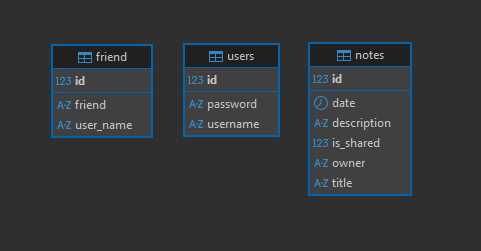
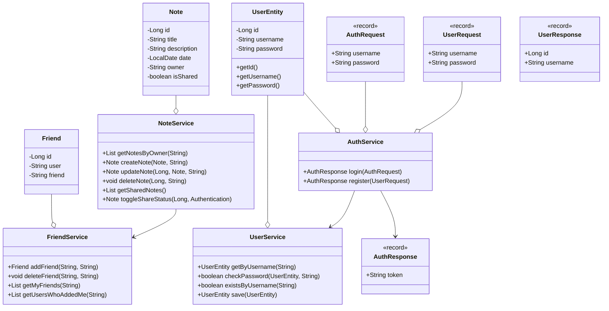

# 📝 Secure Note Application

A secure note-taking application with friend system and note sharing capabilities.

## 🚀 Features
- 🔐 User Authentication with JWT
- 👥 Friend Management System
- 📝 Secure Note Creation and Sharing
- 🔒 Access Control
- 🌐 REST API


## 🛠 Tech Stack
- **Framework**: Spring Boot 3
- **Security**: Spring Security with JWT
- **Database**: MySQL (Docker)
- **Documentation**: OpenAPI (Swagger)
- **Build Tool**: Maven
- **Java Version**: 21

## 🏃‍♂️ Running the Application

### Prerequisites
- Java 21
- Docker
- Maven

### Steps
1. Clone the repository
2. Start the database:
```bash
docker-compose up -d
```
1. Run the application:
```bash
mvn spring-boot:run
```

## 📚 API Documentation

The API documentation is available via Swagger UI at: `http://localhost:8080/swagger-ui/index.html`

### Example Endpoints
- `POST /api/auth/register` - Register new user
- `POST /api/auth/login` - Login user
- `POST /api/auth/logout` - Logout user

## 📝 Note Management

Notes can be private or shared with friends.

### Example Endpoints
- `GET /api/notes` - Get user's notes
- `POST /api/notes` - Create new note
- `PUT /api/notes/{id}` - Update note
- `DELETE /api/notes/{id}` - Delete note
- `GET /api/notes/shared` - Get shared notes

## 👥 Friend System

Users can add friends and share notes with them.

### Example Endpoints
- `GET /api/friends` - Get user's friends
- `POST /api/friends/{username}` - Add friend
- `DELETE /api/friends/{username}` - Remove friend

### Swagger UI Screenshot


## 🔒 Security Features
- Password encryption using BCrypt
- JWT-based authentication
- HTTP-only cookies
- CORS configuration
- Protected endpoints
- Input validation

## 🏗 Architecture

### Database Diagram


### Class Diagram


## 📄 License
This project is licensed under the MIT License - see the LICENSE file for details.
